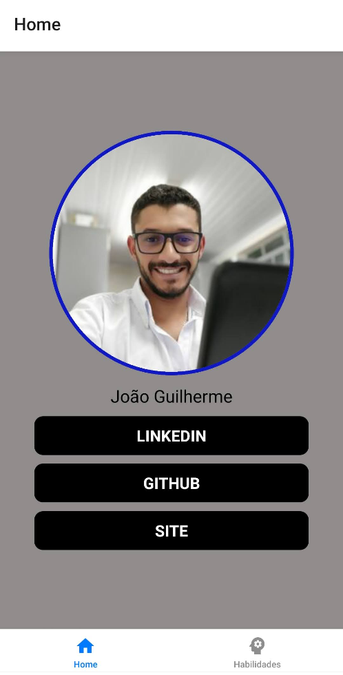

# 📱 Portfólio Mobile

Aplicativo de portfólio desenvolvido em **React Native** com **Expo** e **TypeScript**, apresentando de forma moderna e interativa minhas informações profissionais, habilidades e links de contato.

O projeto utiliza navegação por abas inferiores, com uma **tela principal (Home)** e uma **tela de Habilidades**, integrando ícones e animações leves para uma melhor experiência visual.

---

## 💻 Sobre o Projeto

O **Portfólio Mobile** foi criado com o objetivo de apresentar minhas informações de forma acessível e responsiva em um aplicativo.
A estrutura é simples e intuitiva, composta por duas telas principais:

* **🏠 Home:**
  Contém minha foto, nome e botões com links diretos para:

  * LinkedIn
  * GitHub
  * Meu site pessoal

* **⭐ Habilidades:**
  Exibe minhas principais habilidades com um **rank de estrelas** (0 a 5), acompanhado de:

  * Uma imagem ilustrativa
  * Um título de seção
  * Botão “Fale Comigo”, que direciona para meu contato

---

## 🧩 Tecnologias Utilizadas

O projeto foi construído com as seguintes tecnologias e bibliotecas:

* **[React Native](https://reactnative.dev/)** – Framework principal
* **[Expo](https://expo.dev/)** – Ferramenta para desenvolvimento e build
* **[TypeScript](https://www.typescriptlang.org/)** – Tipagem estática e maior segurança no código
* **[@react-navigation/native](https://reactnavigation.org/docs/getting-started)** – Navegação entre telas
* **[@react-navigation/bottom-tabs](https://reactnavigation.org/docs/bottom-tab-navigator)** – Navegação por abas inferiores
* **[react-native-screens](https://github.com/software-mansion/react-native-screens)** – Otimização da performance da navegação
* **[expo/vector-icons](https://docs.expo.dev/guides/icons/)** – Ícones para botões e navegação

---

## 🚀 Como Executar o Projeto

### Pré-requisitos

Antes de começar, você precisará ter instalado:

* **Node.js**
* **Expo CLI** (`npm install -g expo-cli`)
* Um **emulador Android/iOS** ou o **app Expo Go** no seu dispositivo

### Passos para execução

```bash
# Clone o repositório
git clone https://github.com/seu-usuario/portfolio-mobile.git

# Acesse a pasta do projeto
cd portfolio-mobile

# Instale as dependências
npm install
# ou
yarn install

# Execute o app
npx expo start
```

Após rodar o comando, escaneie o QR Code com o aplicativo **Expo Go** no seu celular ou execute no emulador.

---

## 🌟 Funcionalidades

✅ Exibição da foto e nome na tela inicial
✅ Botões com links diretos para LinkedIn, GitHub e site pessoal
✅ Tela com habilidades e avaliação em estrelas
✅ Botão “Fale Comigo” redirecionando ao contato
✅ Navegação fluida entre abas com ícones personalizados
✅ Totalmente responsivo e compatível com Android e iOS

---

## 🧠 Conceitos Praticados

* Componentização e reaproveitamento de código
* Tipagem com TypeScript
* Configuração de rotas e navegação com React Navigation
* Uso de ícones com **expo/vector-icons**
* Estilização com **StyleSheet** do React Native
* Organização modular e boas práticas

---

## 📸 Demonstração




---

## 👨‍💻 Autor

**João Dev**
📎 [LinkedIn](https://www.linkedin.com/in/joaosouza-dev/)
💻 [GitHub](https://github.com/Dev-JoaoSouza)
🌐 [Portfólio](https://joaodev.site/)
